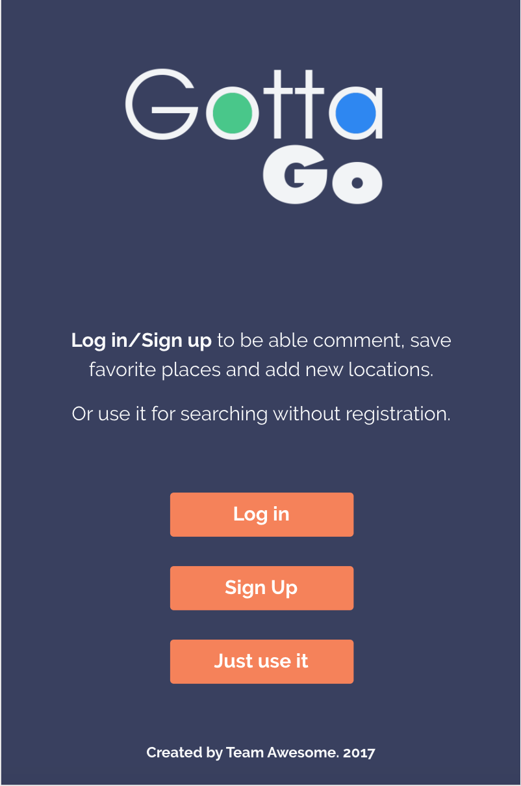

# Gotta Go!

## The crowdsourced mobile application for people who drive a lot.

This application combines the use of MySQL, Sequelize, EJS, and Bulma to create a user-friendly crowdsourcing experience. Drivers for services like Uber or Lyft sometimes need to find restrooms in areas they don't know very well. This is where Gotta Go comes in: drivers can locate local restrooms (as well as cafes and gas stations) based on other driver recommendations.

Users can toggle between the Map and List views. The Map view queries the Google Maps API and the MySQL database for local restrooms, displaying their location and category (Restaurant, Gas Station, or other). In the List view, individual tiles with each restroom are displayed. Users can also add restrooms to the database, as well as comments on each restroom.  

This application was created as a group project for the UC Berkeley Extension Coding Boot Camp in November 2017.

